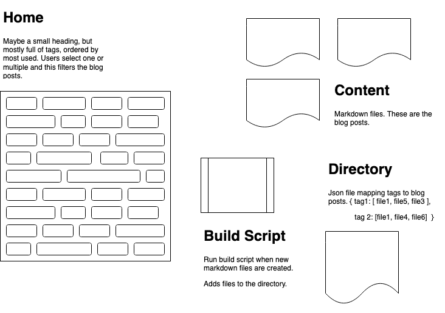

:desc I made this blog in Vue.js; this post explains how I went about it with some technical detail.
:tags code, vue, javascript, node, npm

# Defining the Blogging Problem
There are many plug and play blogging solutions out there. With some research I could probably serve them from my personal url while still serving the main site with Netlify. 

But, I've grown to love Netlify and wanted to come up with a blogging solution I could write in Vue.js. Besides that, I have been spinning my brain on different ways of presenting content. For some blogs, a content-first approach makes a lot of sense. But I don't want to start a Tech blog or a Poetry blog. Mostly I just want a place to spill the contents of my brain in a somewhat organized fashion. 

I have blogged in the past and it doesn't take long to feel the pressure to create a unified topic of some sort. ***What is this blog about?***

I wanted to make a blog that:
* Organized content by topic-first, not chronology
* Allowed for readers to tune in to specific topics without seeing other posts
* Used markdown format for easy document creation
* Could be implemented entirely in Vue.js and served through Netlify.

# Initial Design 


I made a quick design with four core components: 
1. **Blog home page** would be almost entirely tags. Each tag contains a topic. Clicking a tag would show blog posts with that topic.
2. **Content**. These would be markdown files which will be processed into html for the end user. I wanted to use markdown so I could write posts in Visual Studio Code.
3. **Build script** to run when new markdown files are created. The *new post flow* would be to write in markdown, run the build script to update the directory, and then deploy to Netlify.
4. **Directory** which holds a list of all posts with some metadata as well as a list of all tags and information about how they relate to the posts. 

# Implementation

I implemented this blog design in three main chunks of code. Check out [github](https://github.com/beefan/myhomepage) for complete implementation in context, but I'll also post some code here. 

1. Step one was to write some javascript to generate a directory. 

Here's the main function in the `generate-directory.js` file.

```javascript
const fs = require('fs');

updateBlogDirectory();

function updateBlogDirectory() {
    const dir = "directory.json";
    let directory = null;
    try {
        directory = require(`./${dir}`);
    } catch (err) {
        directory = {
            "files": [],
            "tags": {}
        }
    }
    const newFiles = getNewFiles(directory);
    newFiles.forEach(filename => {
        addNewFileToDirectory(directory, filename)
    });

    fs.writeFileSync(`./src/assets/blogs/${dir}`, JSON.stringify(directory));
}
```

The `updateBlogDirectory` function: 
* Tries to load a `directory.json` file and creates one with proper format if it can't.
* Calls a helper function `getNewFiles` to get new markdown files.
* Iterates through the new files and calls `addNewFileToDirectory` which parses the files metadata and adds it to the directory.
* Writes the new json directory back to `directory.json`.

Each time I write a blog post, I'll update the directory by running:
```
node /src/assets/blogs/generate-directory.js
```

2. Step two was the write a `blog.js` module that I could load into my Vue project to get information from the directory. I'll show you two methods.

```javascript
getTags() {
    let result = [];
    for (let tag in this.directory.tags) {
        result.push({ "tag": tag, "count": this.directory.tags[tag].length });
    }
    return result;
}
```

When I first load the blog, I'll call `blog.getTags` to get a list of javascript objects with the tags and the number of times that tag is used in blog posts. I'll show this on the main page and use the count to determine the size of the tag.

```javascript
getFilesByTag(tag) {
    let files = this.directory.tags[tag];
    return files.map(fileIndex => this.directory.files[fileIndex]);
}
```
I'll run `blog.getFilesByTag` when the user clicks on a particular tag. This function returns all files that have their index in the array attached to the selected tag. 

3. The final part of this project is the actual Vue component. 

The `Blog.vue` component is nearly 200 lines so I won't post it all here, but I'll post the template section. Please note, I am using the [pug templating engine](https://vue-loader.vuejs.org/guide/pre-processors.html#pug) as well as [bootstrap-vue](https://bootstrap-vue.org/) so if you aren't use to these the code might seem a little strange.

There are essentially 5 rows inside of a responsive bootstrap container.

The first row is navigation, and if a file is loaded, the title and desc of the post as well.
```
  b-row
    a.home-link(href="/") Home /
    a.blog-link(href="/blog") Blog
  .post-header(v-if="loadedFile")
    b-row.title
      h1 {{ loadedFile.title }}
    b-row.desc
      p {{ loadedFile.desc }}
```
The second row is the section of tags. If no file is chosen, this populates with all tags. Otherwise, tags for one post or a list of posts will populate `tagPalette`.
```
  b-row#palette-main(:style="loadedFile ? 'margin: 1%;' : 'margin: 5%;'")
    b-form.tag-palette
      b-button.mb-2.mr-sm-2.mb-sm-2(
        @click="showFiles",
        v-for="tag in tagPalette",
        :size="tag.count < maxCount ? 'sm' : tag.count > 2 * maxCount ? 'lg' : 'md'",
        pill,
        variant="outline-info"
      ) {{ tag.tag }}
```
When a tag is clicked, we show the third row which is a list of all the files with their title and description.
```
  b-row#file-list(v-if="filesToShow")
    ul
      li.file-list-item(
        @click="processFile",
        v-for="(file, index) in filesToShow",
        :id="index"
      ) 
        h4 {{ file.title }}
        p {{ file.desc }}
```
The fourth row is shown if a file is loaded. This is just the date of the post and a share button which copies the link to the post when clicked. 
```
  b-row.date(v-if="loadedFile")
    p {{ loadedFileDate }}
    .share-icon(@click="shareLink")
      b-icon-box-arrow-up
    p.link-text
    input(type="hidden")
```
And finally, there is a fifth row also only shown if a post is loaded. This row uses [VueShowdown](https://vue-showdown.js.org/guide/#npm) which does all the work of actually parsing the markdown text into html.
```
  b-row#file-view(v-if="loadedFile")
    VueShowdown(:markdown="loadedFile.text")
</template>
```
## Some other fun notes

* To serve the blog posts, I had to place all the markdown files in the `public` directory so that when Vue builds the website it makes the posts available. 
* Since I'm using a single page web app, the url never changes. I added some logic to my `vue-router` to accept requests from `/blog/post/:post-name` so that I can generate share urls for the user that will load the same post again. On the vue `mounted()` lifecycle hook, I check for url parameters and if I find a file name, call to `blog.findFileByName` to fetch the file's information and load it. 

In the `router/index.js file`
```javascript
  {
    path: "/blog/post/:post",
    name: "BlogPost",
    component: () => import("../views/Blog.vue")
  }
```
In `Blog.vue`
```javascript
  mounted() {
    if (this.$route.params.post) {
      const file = blog.findFileByName(this.$route.params.post);
      if (file == "filenotfound") {
        this.$bvToast.toast("explore other posts on this blog", {
          title: "No Post Exists With that Name",
          variant: "danger",
          toaster: "b-toaster-top-center",
          href: "/blog"
        });
      } else {
        file.title = this.formatTitle(file.name);
        this.loadFile(file);
      }
    } else {
      this.fetchPalette();
    }
  }
```

In `blog.js`
```javascript
findFileByName(name) {
    const files = this.directory.files.filter(file => file.name == name);
    return files[0] ? files[0] : 'filenotfound';
}
```

---

Overall, I had a lot of fun with this project and I think the end result is pretty cool too. If any of this interests you, find all the code on [github](https://github.com/beefan/myhomepage).